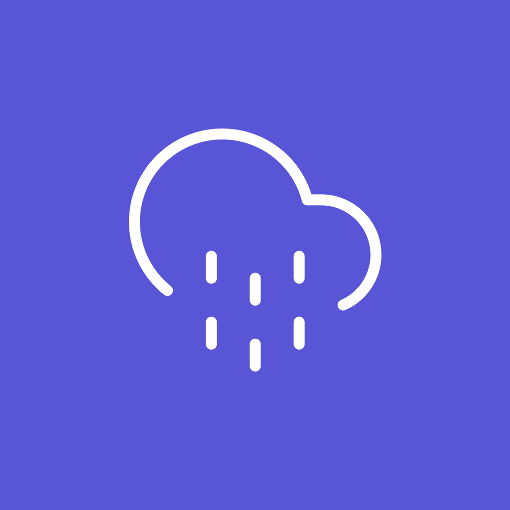
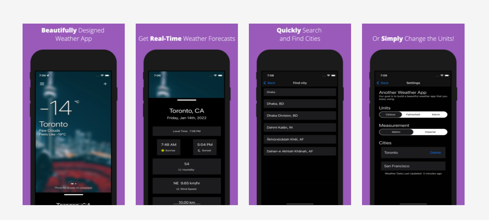

<div id="top"></div>

<!-- PROJECT LOGO -->
<br />
<div align="center">
  <a href="https://github.com/othneildrew/Best-README-Template">
    
  </a>

  <h3 align="center">Another Weather App</h3>

  <p align="center">
    Another simple, but beautiful, weather app.
    <br />
    <a href="#"><strong>App Download Link - Coming Soon</strong></a>
    <br />
    <br />
    <a href="https://github.com/othneildrew/Best-README-Template">View Demo</a>
    ·
    <a href="https://github.com/othneildrew/Best-README-Template/issues">Report Bug</a>
    ·
    <a href="https://github.com/othneildrew/Best-README-Template/issues">Request Feature</a>
  </p>
</div>


<!-- TABLE OF CONTENTS -->
<details>
  <summary>Table of Contents</summary>
  <ol>
    <li>
      <a href="#about-the-project">About The Project</a>
      <ul>
        <li><a href="#built-with">Built With</a></li>
      </ul>
    </li>
    <li>
      <a href="#getting-started">Getting Started</a>
      <ul>
        <li><a href="#prerequisites">Prerequisites</a></li>
        <li><a href="#installation">Installation</a></li>
      </ul>
    </li>
    <li><a href="#usage">Usage</a></li>
    <li><a href="#roadmap">Roadmap</a></li>
    <li><a href="#contributing">Contributing</a></li>
    <li><a href="#license">License</a></li>
    <li><a href="#contact">Contact</a></li>
    <li><a href="#acknowledgments">Acknowledgments</a></li>
  </ol>
</details>


<!-- ABOUT THE PROJECT -->
## About The Project



"Another Weather App" was designed for class project, but I ended up building a fully fledged out mobile application for fun. I wanted something that was simple, and had the images beautifully update based on the city/location that is being requested. 

<p align="right">(<a href="#top">back to top</a>)</p>


### Built With

Some of the major frameworks and services used:

Front End (this repo)
* [React Native / Expo](https://docs.expo.dev/)
* [EAS Expo Build](https://expo.dev/pricing)
* [react-native-fontawesome](https://www.npmjs.com/package/@fortawesome/react-native-fontawesome)

Back End (unreleased). For now you can test the application using this API endpoint: [https://weatherapp.app01.prd.tor.quazi.co/](https://weatherapp.app01.prd.tor.quazi.co/)
* [Node/Express](https://expressjs.com/)
* [Unsplash](https://unsplash.com)
* [OpenWeatherMaps](https://openweathermap.org)

<p align="right">(<a href="#top">back to top</a>)</p>


<!-- GETTING STARTED -->
## Getting Started

To actually build the application you can eject and build it yourself or you can use the EAS Build service provided by Expo (they have a free plan). In any case, make sure to change the bundle IDs or you may run into issues. Those values can be found in `app.json` under `ios.bundleIdentifier` and `android.package`.

### Prerequisites

This is an example of how to list things you need to use the software and how to install them.
* npm
  ```sh
  npm install npm@latest -g
  ```

### Installation

If you are not setting up your own server, you can use our server and therefore don't need to register for a API key from Unsplash or Open Weather Maps.

1. Clone the repo
   ```sh
   git clone https://github.com/blacksector/react-native-weather-app.git
   ```
2. Enter the folder
   ```sh
   cd react-native-weather-app
   ```
3. Install NPM packages (you can also use Yarn)
   ```sh
   npm i
   ```
4. Choose your platform and run:

   iOS
   ```sh
   npm run ios
   ```
   Android
   ```sh
   npm run android
   ```

_Something to keep in mind, because of one of the components being used (`reanimated-bottom-sheet`), the web version does not work, therefore running `npm run start` will fail._

<p align="right">(<a href="#top">back to top</a>)</p>


<!-- USAGE EXAMPLES -->
## Usage

If you build out the application, you can simply have it installed on your mobile application or simulator without additional work. Moving forward I will be adding a link to download the app directly from the app store.

<p align="right">(<a href="#top">back to top</a>)</p>


<!-- ROADMAP -->
## Roadmap

- [ ] Add better way to search cities and adding them
- [ ] Make the API queries lighter and faster
- [ ] Add notifications (hourly, every 3 hours, severe weather alerts, etc)
- [ ] Multi-language Support
    - [ ] French
    - [ ] Spanish

See the [open issues](https://github.com/blacksector/react-native-weather-app/issues) for a full list of proposed features (and known issues).

<p align="right">(<a href="#top">back to top</a>)</p>


<!-- CONTRIBUTING -->
## Contributing

Contributions are what make the open source community such an amazing place to learn, inspire, and create. Any contributions you make are **greatly appreciated**.

If you have a suggestion that would make this better, please fork the repo and create a pull request. You can also simply open an issue with the tag "enhancement".
Don't forget to give the project a star! Thanks again!

<small>Text used from [Best-README-Template](https://github.com/othneildrew/Best-README-Template/blob/master/README.md).</small>

1. Fork the Project
2. Create your Feature Branch (`git checkout -b feature/AmazingFeature`)
3. Commit your Changes (`git commit -m 'Add some AmazingFeature'`)
4. Push to the Branch (`git push origin feature/AmazingFeature`)
5. Open a Pull Request

<p align="right">(<a href="#top">back to top</a>)</p>


<!-- LICENSE -->
## License

Distributed under the MIT License. See [LICENSE.txt](LICENSE.txt) for more information.

<p align="right">(<a href="#top">back to top</a>)</p>


<!-- CONTACT -->
## Contact

Omar Quazi - [LinkedIn](https://www.linkedin.com/in/omarquazi/) - [omar@quazi.co](mailto:omar@quazi.co)

Project Link: [https://omar.to/portfolio/weather](https://omar.to/portfolio/weather)

<p align="right">(<a href="#top">back to top</a>)</p>


<!-- ACKNOWLEDGMENTS -->
## Acknowledgments


* [Choose an Open Source License](https://choosealicense.com)
* [Best-README-Template](https://github.com/othneildrew/Best-README-Template/blob/master/README.md)

<p align="right">(<a href="#top">back to top</a>)</p>
